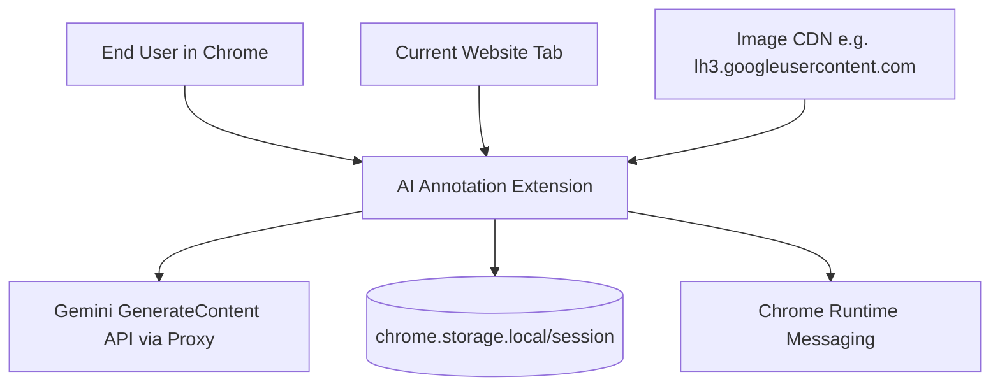
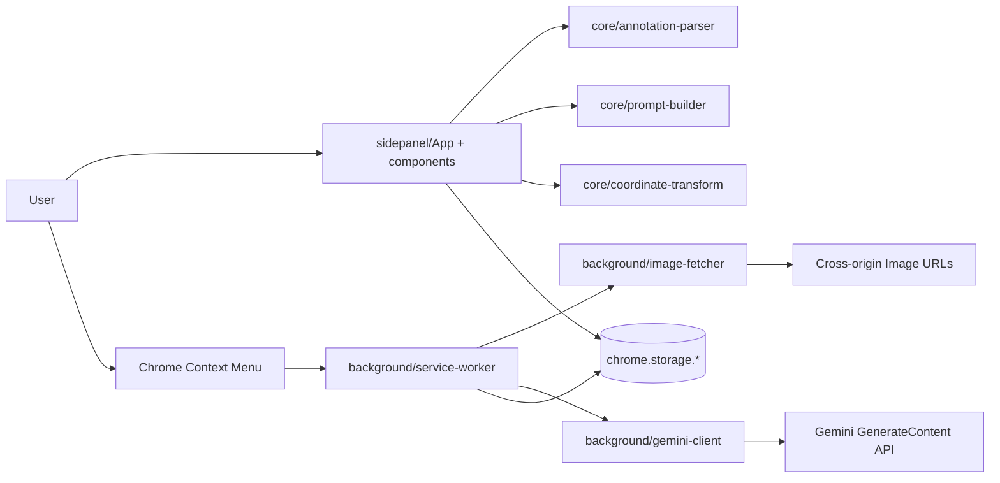
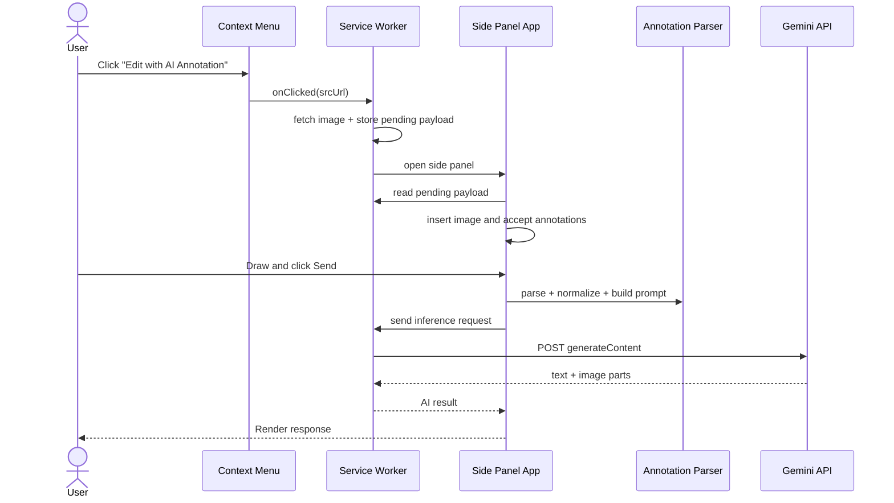
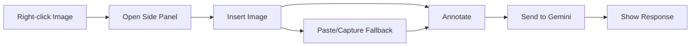
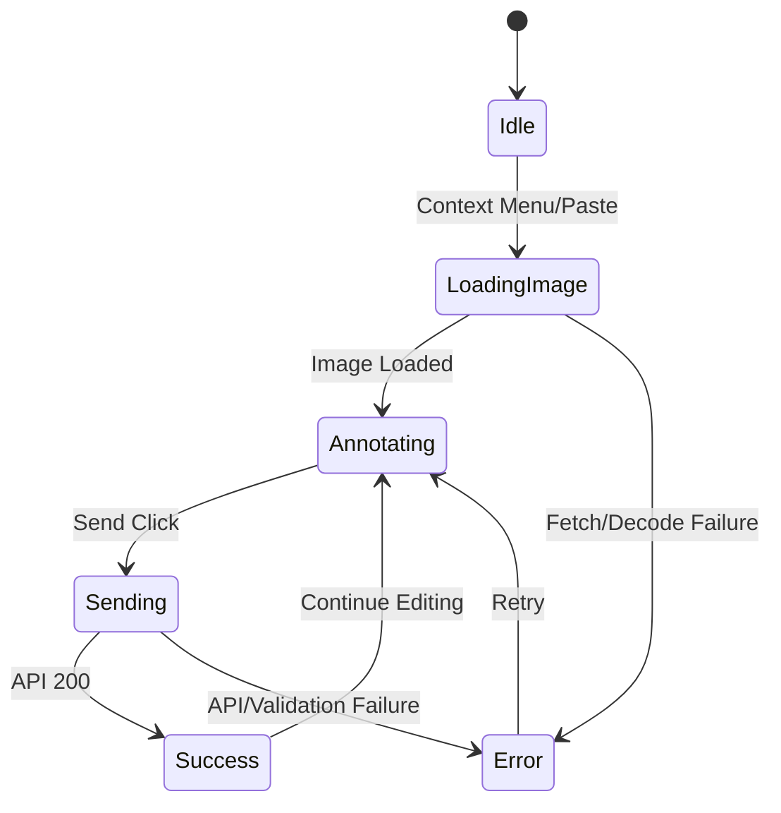

# Solution Design Document

## Validation Checklist

### CRITICAL GATES (Must Pass)

- [x] All required sections are complete
- [x] No placeholder markers remain
- [x] Architecture pattern is clearly stated with rationale
- [ ] **All architecture decisions confirmed by user**
- [x] Every interface has specification

### QUALITY CHECKS (Should Pass)

- [x] All context sources are listed with relevance ratings
- [x] Project commands are discovered from actual project files
- [x] Constraints → Strategy → Design → Implementation path is logical
- [x] Every component in diagram has directory mapping
- [x] Error handling covers all error types
- [x] Quality requirements are specific and measurable
- [x] Component names consistent across diagrams
- [x] A developer could implement from this design

---

## Constraints

CON-1 Chrome-only MVP using Manifest V3 and Side Panel API; extension UX must work in constrained side-panel width.
CON-2 Right-click image flow must support CORS-restricted origins (e.g., Gemini CDN), so image fetch must run in service worker with proper host permissions.
CON-3 Image+annotation requests must fit Gemini multimodal payload limits; payload size target is <=1 MB for original image after compression.
CON-4 MVP scope excludes auto-annotate, multi-image sessions, real-time collaboration, and offline mode.
CON-5 Current codebase is partially implemented; architecture decisions must reconcile legacy spec text with the actual extension source under `extension/src`.

## Implementation Context

**IMPORTANT**: You MUST read and analyze ALL listed context sources to understand constraints, patterns, and existing architecture.

### Required Context Sources

#### Documentation Context
```yaml
- doc: CLAUDE.md
  relevance: CRITICAL
  why: "Primary implementation plan, module boundaries, and workflow expectations."

- doc: /Users/jc/.agents/skills/architecture-design/template.md
  relevance: HIGH
  why: "Required SDD structure and mandatory sections."

- doc: /Users/jc/.agents/skills/architecture-design/validation.md
  relevance: HIGH
  why: "Completeness and consistency validation criteria for architecture design."
```

#### Code Context
```yaml
- file: /Users/jc/Documents/TQCoding/Lala_Banana/CLAUDE.md
  relevance: CRITICAL
  why: "Single source of project architecture and technical decisions in current repository state."

- file: /Users/jc/Documents/TQCoding/Lala_Banana
  relevance: MEDIUM
  why: "Repository inspection confirms a live extension codebase under `extension/`; used to validate current architecture, commands, and drift from the earlier draft spec."
```

#### External APIs (if applicable)
```yaml
- service: Chrome Extensions API (Manifest V3)
  doc: https://developer.chrome.com/docs/extensions/reference/
  relevance: CRITICAL
  why: "Defines sidePanel, contextMenus, runtime messaging, storage.session, and service worker lifecycle constraints."

- service: Google Gemini GenerateContent API (via internal proxy)
  doc: https://ai.google.dev/api/generate-content
  relevance: CRITICAL
  why: "Defines multimodal request schema, response modalities, and image+text response contract used by the current implementation."

- service: Googleusercontent image CDN behavior
  doc: https://lh3.googleusercontent.com/* (runtime URL pattern)
  relevance: MEDIUM
  why: "Gemini image URL suffix handling and resolution optimization strategy."
```

### Implementation Boundaries

- **Must Preserve**: Right-click-on-image entry, side panel editing workflow, shape-based annotation model (rectangle/arrow/text), and Gemini multimodal integration.
- **Can Modify**: Internal module layout, messaging handshake implementation details, exact UI composition, and host permission scope refinement.
- **Must Not Touch**: Non-project systems, browser-level settings, and out-of-scope features from MVP exclusions.

### External Interfaces

#### System Context Diagram



#### Interface Specifications

```yaml
inbound:
  - name: "Context Menu Image Action"
    type: Chrome event
    format: contextMenus.onClicked payload
    authentication: Browser extension permission model
    doc: https://developer.chrome.com/docs/extensions/reference/api/contextMenus
    data_flow: "image srcUrl + page metadata from right-clicked ."

  - name: "Clipboard Paste"
    type: DOM event
    format: ClipboardEvent with image/* items
    authentication: User interaction in extension panel
    doc: https://developer.mozilla.org/en-US/docs/Web/API/ClipboardEvent
    data_flow: "pasted image blob inserted into canvas as source image."

  - name: "Side Panel User Actions"
    type: UI interaction
    format: React component event handlers
    authentication: Extension UI session
    doc: @sidepanel/components/*.tsx (NEW)
    data_flow: "draw annotations, input instruction, trigger send/export."

outbound:
  - name: "Gemini GenerateContent API via Proxy"
    type: HTTPS
    format: JSON
    authentication: Bearer token to proxy
    doc: https://ai.google.dev/api/generate-content
    data_flow: "original image + annotated image + structured prompt."
    criticality: HIGH

  - name: "Image Fetch by Service Worker"
    type: HTTPS
    format: binary image fetch -> base64
    authentication: host_permissions
    doc: https://developer.chrome.com/docs/extensions/develop/concepts/network-requests
    data_flow: "retrieves cross-origin images from srcUrl."
    criticality: HIGH

data:
  - name: "Session Pending Payload"
    type: chrome.storage.session
    connection: Chrome extension API
    doc: https://developer.chrome.com/docs/extensions/reference/api/storage
    data_flow: "bridges race condition between side panel mount and SW message."

  - name: "Canvas Runtime State"
    type: In-memory tldraw editor state
    connection: React + tldraw runtime
    doc: https://tldraw.dev/
    data_flow: "source image asset + annotation shapes for parse/export."

  - name: "Per-Page Session State"
    type: In-memory React state keyed by `TLPageId`
    connection: `sidepanel/App.tsx`
    doc: @extension/src/sidepanel/App.tsx
    data_flow: "tracks imageMeta, imageShapeId, responseParts, instruction, skills, and imageContext for each page."
```

### Cross-Component Boundaries (if applicable)

- **API Contracts**: Runtime message schema (`IMAGE_FROM_CONTEXT_MENU`, `CAPTURE_TAB`, `SEND_TO_AI`) and parsed annotation payload are public internal contracts.
- **Team Ownership**: Single-team ownership assumed for MVP; boundaries still enforced by folder/module ownership.
- **Shared Resources**: chrome.storage, runtime message bus, and shared `core/types.ts` contracts.
- **Breaking Change Policy**: Any message schema change requires versioned type update and backward compatibility shim for one minor version.

### Project Commands

```bash
# Core Commands (discovered from extension/package.json)
Install: pnpm install
Dev:     pnpm --dir extension dev
Test:    Not configured
Lint:    Not configured
Build:   pnpm --dir extension build
```

## Solution Strategy

- Architecture Pattern: Modular extension architecture with layered separation (`background`, `sidepanel`, `core`, `content`, `config`).
- Integration Approach: Event-driven Chrome runtime messaging connects context menu, service worker fetch pipeline, and side panel canvas editor.
- Justification: This pattern aligns with MV3 service-worker constraints, isolates domain logic in `core`, and limits UI coupling to extension APIs.
- Key Decisions: Use Side Panel for persistent context, tldraw for annotation primitives, normalized image-relative coordinates for AI precision, and dual-context annotation (visual + structured text).

## Building Block View

### Components


### Directory Map

**Component**: extension-runtime
```
.
├── extension/
│   ├── manifest.json                    # NEW: MV3 permissions, side_panel, background wiring
│   ├── background/
│   │   ├── service-worker.ts            # NEW: lifecycle, context menu, message routing
│   │   ├── image-fetcher.ts             # NEW: CORS bypass image fetch and URL optimization
│   │   └── gemini-client.ts             # NEW: Gemini proxy request handling + system prompt
│   ├── sidepanel/
│   │   ├── index.html                   # NEW: panel entry
│   │   ├── App.tsx                      # NEW: state orchestration + runtime listeners
│   │   ├── components/
│   │   │   ├── CanvasEditor.tsx         # NEW: tldraw mount and tool controls
│   │   │   ├── Toolbar.tsx              # NEW: send/paste/export interactions
│   │   │   └── ResultPanel.tsx          # NEW: AI response rendering
│   │   └── styles.css                   # NEW: side panel responsive layout
│   ├── content/
│   │   └── capture.ts                   # NEW: capture trigger bridge
│   ├── core/
│   │   ├── annotation-parser.ts         # NEW: shape parsing and relation resolution
│   │   ├── coordinate-transform.ts      # NEW: canvas -> normalized image coordinates
│   │   ├── prompt-builder.ts            # NEW: structured prompt assembly
│   │   ├── image-utils.ts               # NEW: compression, insert, crop
│   │   └── types.ts                     # NEW: shared contracts
│   ├── config/
│   │   └── api-config.ts                # NEW: API key storage helper
│   └── vite.config.ts                   # NEW: CRX + React build pipeline
```

### Interface Specifications

#### Interface Documentation References

```yaml
interfaces:
  - name: "Chrome Extension Runtime Interfaces"
    doc: https://developer.chrome.com/docs/extensions/reference/
    relevance: CRITICAL
    sections: [sidePanel, contextMenus, runtime, storage, tabs]
    why: "Defines extension boundary contracts and permission-driven behavior."

  - name: "Gemini GenerateContent API"
    doc: https://ai.google.dev/api/generate-content
    relevance: CRITICAL
    sections: [contents, systemInstruction, generationConfig, inlineData]
    why: "Defines outbound multimodal request and image/text response contract."

  - name: "Internal Message Contract"
    doc: @extension/core/types.ts (NEW)
    relevance: HIGH
    sections: [runtime_messages, parse_result, api_request]
    why: "Prevents message drift between service worker and side panel."
```

#### Data Storage Changes

```yaml
Table: chrome.storage.session (logical keyspace)
  ADD KEY: pendingImage (object: base64, sourceUrl, timestamp)

schema_doc: @extension/config/api-config.ts (NEW)
migration_scripts: Not required (browser-managed key/value storage)
```

#### Internal API Changes

```yaml
Endpoint: Runtime Message - Receive image from context menu
  Method: chrome.runtime.sendMessage
  Path: type=IMAGE_FROM_CONTEXT_MENU
  Request:
    payload.base64: string, required
    payload.sourceUrl: string, required
    payload.pageUrl: string, optional
    payload.pageTitle: string, optional
  Response:
    success:
      acknowledged: boolean
    error:
      error_code: PANEL_NOT_READY | INVALID_PAYLOAD
      message: string

Endpoint: Runtime Message - Capture tab
  Method: chrome.runtime.sendMessage
  Path: type=CAPTURE_TAB
  Request:
    none: trigger-only
  Response:
    success:
      dataUrl: string
    error:
      error_code: CAPTURE_FAILED | PERMISSION_DENIED
      message: string

Endpoint: Outbound AI inference
  Method: HTTPS POST
  Path: https://api.antamediadhcp.com/api/provider/google/v1beta/models/gemini-3.1-flash-image:generateContent
  Request:
    systemInstruction.parts[]: text
    contents[0].parts[]: [originalImage, annotatedImage, prompt]
    generationConfig.responseModalities[]: ['TEXT', 'IMAGE']
  Response:
    success:
      candidates[0].content.parts[]: [text?, inlineData?]
    error:
      error_code: API_ERROR
      message: string

api_doc: @extension/background/gemini-client.ts
openapi_spec: Not applicable (third-party API)
```

#### Application Data Models

```pseudocode
ENTITY: ParsedAnnotation (NEW)
  FIELDS:
    type: 'highlight' | 'arrow' | 'instruction' | 'freehand-circle'
    region: NormalizedRect?
    pointer: { from, to, targetRegion? }?
    text: string?
    _shapeId: string

  BEHAVIORS:
    parseFromShape(shape, imageShape): ParsedAnnotation
    resolveProximityRelations(annotations): ParsedAnnotation[]

ENTITY: PendingImagePayload (NEW)
  FIELDS:
    base64: string
    sourceUrl: string
    timestamp: number
  BEHAVIORS:
    isFresh(now): boolean

ENTITY: AIRequest (NEW)
  FIELDS:
    originalImage: base64 string
    annotatedImage: base64 string
    prompt: string
  BEHAVIORS:
    validateSize(maxBytes): boolean

ENTITY: ConversationEntry (NEW)
  FIELDS:
    role: 'user' | 'model'
    text: string
    timestamp: number
  BEHAVIORS:
    appendToHistory(history): ConversationEntry[]

ENTITY: ImageContext (NEW)
  FIELDS:
    history: ConversationEntry[]
    generation: number
    originalSourceUrl: string?
  BEHAVIORS:
    trimHistory(maxEntries): ImageContext
    incrementGeneration(): ImageContext

ENTITY: PageState (CURRENT IMPLEMENTATION)
  FIELDS:
    imageMeta: ImageMeta?
    imageShapeId: TLShapeId?
    responseParts: AIResponsePart[]
    aiError: string?
    loading: boolean
    instruction: string
    skills: SkillsConfig
    imageContext: ImageContext
  BEHAVIORS:
    updatePageState(pageId, partial): PageState
    resetOnClear(): PageState
```

#### Integration Points

```yaml
- from: background/service-worker
  to: sidepanel/App
    - protocol: Chrome runtime messaging
    - doc: @extension/core/types.ts (NEW)
    - endpoints: [IMAGE_FROM_CONTEXT_MENU, IMAGE_CAPTURED]
    - data_flow: "Fetched image payload and panel readiness coordination"

- from: sidepanel/App
  to: core/annotation-parser
    - protocol: in-process function call
    - doc: @extension/core/annotation-parser.ts (NEW)
    - endpoints: [parseAnnotations]
    - data_flow: "Convert editor shapes into structured annotation objects"

Gemini_API:
  - doc: https://ai.google.dev/api/generate-content
  - sections: [generateContent, parts, inlineData]
  - integration: "background/gemini-client sends multimodal prompt and receives text + image parts"
  - critical_data: [originalImage, annotatedImage, prompt, systemInstruction]
```

### Implementation Examples

**Purpose**: Provide strategic code examples to clarify complex logic, critical algorithms, or integration patterns. These examples are for guidance, not prescriptive implementation.

**Include examples for**:
- Complex business logic that needs clarification
- Critical algorithms or calculations
- Non-obvious integration patterns
- Security-sensitive implementations
- Performance-critical sections

#### Example: Side Panel Handshake for Pending Image

**Why this example**: Solves race condition where service worker dispatches image before side panel listener mounts.

```typescript
// background/service-worker.ts
await chrome.sidePanel.open({ tabId })
await chrome.storage.session.set({ pendingImage })
try {
  await chrome.runtime.sendMessage({ type: 'IMAGE_FROM_CONTEXT_MENU', payload: pendingImage })
} catch {
  // Panel not ready; App.tsx will recover from storage.session
}
```

#### Example: Coordinate Normalization

**Why this example**: AI prompt precision depends on stable image-relative coordinates independent of zoom/pan.

```typescript
function normalizeToImageCoords(shapeRect, imageRect) {
  return {
    x: clamp01((shapeRect.x - imageRect.x) / imageRect.w),
    y: clamp01((shapeRect.y - imageRect.y) / imageRect.h),
    w: clamp01(shapeRect.w / imageRect.w),
    h: clamp01(shapeRect.h / imageRect.h),
  }
}
```

#### Test Examples as Interface Documentation

```typescript
describe('parseAnnotations', () => {
  it('maps rectangle shape to normalized highlight region', () => {
    expect(result[0]).toMatchObject({
      type: 'highlight',
      region: { x: 0.25, y: 0.4, w: 0.3, h: 0.2 },
    })
  })
})
```

## Runtime View

### Primary Flow

#### Primary Flow: Right-click image -> annotate -> send to AI
1. User right-clicks an image and selects `Edit with AI Annotation`.
2. Service worker validates `srcUrl`, fetches image with host permissions, and stores pending payload in `chrome.storage.session`.
3. Side panel opens, reads pending payload, inserts image into tldraw canvas, and locks base image shape.
4. User creates annotation shapes and optional instruction text.
5. Side panel parses shapes, normalizes coordinates, builds prompt, and exports annotated canvas image.
6. Background Gemini client sends multimodal request to proxy API.
7. AI response returns text and optional generated image, then renders in result panel.



#### Reviewed Flow: Iterative edit with response image and prompt history
1. User sends page content to AI from the current `TLPageId`.
2. App builds prompt from annotation summary, input prompt, selected skill templates, and `imageContext.history`.
3. When AI returns, App appends a user/model pair into `imageContext.history`.
4. If user clicks `Load to canvas`, response image is inserted into the current page and `imageContext.generation` is incremented.
5. Subsequent sends include the accumulated edit history in the prompt.

Design review of current implementation:
- Improvement: the new `ImageContext` model in `core/types.ts` and `App.tsx` gives the system an explicit concept of iterative generations and prompt history.
- Remaining gap: prompt composition is still split across UI (`SkillsPanel`), side-panel orchestration (`App.tsx`), core (`prompt-builder.ts`), and integration (`gemini-client.ts`), so there is no single canonical prompt envelope.
- Remaining gap: async operations still capture `pageId` before `await`, but canvas insertion resolves against the editor's current page at execution time; this can still desynchronize multi-page state and rendered design assets.
- Remaining gap: `Load to canvas` currently inserts a new image and promotes it to `imageMeta`, but does not define whether old annotations and previous images should be cleared, archived, or moved to a new page.

#### Reviewed Flow: Multi-page design session
Current behavior:
- `pageStates` stores design metadata per `TLPageId`.
- Duplicating selected shapes to a new page now attempts to carry both `imageMeta` and `imageContext`.
- Prompt/history state therefore survives better across derived pages than before.

Open architecture concerns:
- There is still no first-class `PageDesignSession` aggregate to bind canvas page, source image, prompt lineage, and AI run history into one contract.
- Deleting or mutating page contents can still invalidate `imageShapeId` and `imageMeta` without a reconciliation pass against the tldraw store.
- The new-page duplication flow depends on shape discovery after page mutation, which remains fragile without an explicit target-page insertion API.

### Error Handling

- Invalid input: If `srcUrl` missing or non-image MIME, system shows non-blocking error toast and aborts flow.
- Network failure: Service worker retries image fetch once (optimized URL -> original URL fallback); API call errors surface actionable message with retry button.
- Business rule violation: If payload exceeds size budget, system auto-compresses; if still oversized, blocks send and instructs user to crop/resize.

### Complex Logic (if applicable)

```
ALGORITHM: Parse and Prioritize Annotations
INPUT: editor_shapes, image_shape
OUTPUT: parsed_annotations, prompt_text

1. FILTER: remove base image shape and unsupported shape types
2. MAP: convert each supported shape to typed annotation entity
3. NORMALIZE: convert canvas coordinates to 0-1 image-relative space
4. RESOLVE_RELATIONS:
   - attach nearby text to nearest highlight
   - attach arrow target relation when bindings exist
5. VALIDATE: drop malformed/out-of-bounds annotations
6. SERIALIZE: build deterministic prompt sections by annotation type
7. RETURN: parsed annotations and prompt string
```

## Deployment View

### Single Application Deployment
- **Environment**: Client-side Chrome extension (MV3) running in user browser.
- **Configuration**: `manifest.json` permissions/host permissions and proxy endpoint/model configuration in background client.
- **Dependencies**: Chrome 114+, tldraw package, Gemini proxy availability.
- **Performance**: Panel first interactive paint <= 2.5s on cold start; send pipeline <= 8s p95 excluding external API latency.

### Multi-Component Coordination (if applicable)

- **Deployment Order**: Build extension bundle, load unpacked extension, then configure API key and permission acceptance.
- **Version Dependencies**: Runtime message schema version in `core/types.ts` must match background + sidepanel builds.
- **Feature Flags**: `settings.experimentalCrop` for optional crop-enhanced prompt path.
- **Rollback Strategy**: Disable send action on severe API regressions; retain annotation editor as local-only fallback.
- **Data Migration Sequencing**: No schema migration required; in-memory `imageContext` state resets on panel reload.

## Cross-Cutting Concepts

### Pattern Documentation

```yaml
- pattern: Event-driven message orchestration
  relevance: CRITICAL
  why: "MV3 requires asynchronous coordination between service worker and side panel contexts."

- pattern: Layered domain core (`core/*`)
  relevance: HIGH
  why: "Ensures parser/prompt/transform logic remains testable and UI-agnostic."

- pattern: Runtime handshake via session storage (NEW)
  relevance: HIGH
  why: "Prevents message-loss race condition during panel initialization."
```

### User Interface & UX (if applicable)

**Information Architecture:**
- Navigation: Single-entry side panel with editor-first layout, secondary result panel.
- Content Organization: Top toolbar actions, central canvas, bottom/right result area based on width.
- User Flows: Right-click import, paste fallback, capture fallback, annotate, send, review response.

**Design System:**
- Components: Use tldraw built-ins plus minimal custom React components.
- Tokens: Use compact spacing scale and high-contrast controls suitable for narrow panel.
- Patterns: Clear loading states, inline error messages, deterministic send/disable states.

**Interaction Design:**
- State Management: Local React state + editor instance refs, now including per-page `imageContext` for iterative edit history.
- Feedback: Toast on load errors, spinner during send, response panel status markers.
- Accessibility: Keyboard support for paste/send, visible focus states, semantic button labels.

#### UI Visualization Guide

**Entry Points** — Use ASCII wireframes to show where features live:
```
┌─────────────────────────────────────────┐
│ Browser Page (any image)               │
├─────────────────────────────────────────┤
│ Right click on image                    │
│  └─ Edit with AI Annotation   ← NEW    │
└─────────────────────────────────────────┘

┌─────────────────────────────────────────┐
│ Side Panel                              │
├─────────────────────────────────────────┤
│ [Paste] [Capture] [Send] [Export]       │
│ ────────────────────────────────────    │
│             Canvas Editor               │
│      (image + rect/arrow/text tools)    │
│ ────────────────────────────────────    │
│ Result Panel (Gemini response)          │
└─────────────────────────────────────────┘
```

**Screen Flows** — Use Mermaid flowcharts for navigation:


**Component States** — Use Mermaid state diagrams for interactions:


### System-Wide Patterns

- Security: Proxy credential currently exists in source and should be replaced by environment/config injection before release; input validation on runtime messages remains required.
- Error Handling: Typed error codes in background modules, user-facing normalization in UI, retry with bounded attempts.
- Performance: Lazy-load heavy editor runtime, pre-send image compression, optional crop extraction for focused context.
- i18n/L10n: MVP English-first; UI copy centralized to enable later localization.
- Logging/Auditing: Structured console logs with correlation id per send flow; no sensitive payload logging.

### Multi-Component Patterns (if applicable)

- **Communication Patterns**: Request-response runtime messaging with storage-session fallback.
- **Data Consistency**: Single-writer model per flow (service worker owns pending image seed; side panel consumes and clears).
- **Shared Code**: Shared type contracts and parser utilities under `core/`.
- **Service Discovery**: Chrome runtime dispatch by message `type` routing table.
- **Circuit Breakers**: Fast-fail after repeated API failures, temporary send disable window.
- **Distributed Tracing**: Correlation ID propagated from context menu event to API request log scope.

## Architecture Decisions

- [ ] ADR-1 Extension Surface: Use Chrome Side Panel as primary workspace.
  - Rationale: Persistent context and better workflow continuity than popup.
  - Trade-offs: Limited width; requires compact responsive design.
  - User confirmed: _Pending_

- [ ] ADR-2 Canvas Engine: Use tldraw for annotation authoring.
  - Rationale: Strong built-in shape model and practical API for extraction.
  - Trade-offs: Larger bundle footprint and dependency lock-in.
  - User confirmed: _Pending_

- [ ] ADR-3 Coordinate Model: Normalize all annotations to image-relative 0-1 coordinates.
  - Rationale: Stable prompt semantics independent of viewport zoom and source resolution.
  - Trade-offs: Requires transform layer and careful bounds handling.
  - User confirmed: _Pending_

- [ ] ADR-4 Message Reliability: Use `chrome.storage.session` handshake for panel mount race.
  - Rationale: Guarantees payload delivery even when listener is not ready.
  - Trade-offs: Additional state lifecycle cleanup complexity.
  - User confirmed: _Pending_

- [ ] ADR-5 AI Payload Strategy: Send original image + annotated image + structured text.
  - Rationale: Combines visual and semantic context for best instruction fidelity.
  - Trade-offs: Larger request size and processing overhead.
  - User confirmed: _Pending_

- [ ] ADR-6 Multi-Page Session Model: Introduce a first-class `PageDesignSession` contract that owns page-level design state, prompt lineage, and AI run metadata.
  - Rationale: Current `pageStates` map is sufficient for MVP but does not fully protect against drift between async canvas mutations and per-page React state.
  - Trade-offs: More domain modeling and adapter code around tldraw page operations.
  - User confirmed: _Pending_

- [ ] ADR-7 Response Apply Mode: Define `Load to canvas` as one of `replace-base`, `new-variant-page`, or `reference-only`.
  - Rationale: Current behavior inserts a new image and promotes it to the current source image, but leaves old images/annotations on the page, which makes iterative editing semantics ambiguous.
  - Trade-offs: Stricter workflow but clearer model for subsequent sends.
  - User confirmed: _Pending_

- [ ] ADR-8 Prompt Composition Boundary: Centralize prompt assembly in a single `PromptComposer` domain service.
  - Rationale: Prompt inputs are currently split across `SkillsPanel`, `App.tsx`, `prompt-builder.ts`, and `gemini-client.ts`, making the final prompt difficult to trace and test.
  - Trade-offs: Slightly more abstraction, but much better debuggability and consistency.
  - User confirmed: _Pending_

## Quality Requirements

- Performance: Image import to canvas ready <= 2s p95 for 2048px images on typical laptop; prompt build <= 150ms p95.
- Usability: Core flow (right-click -> annotate -> send) completable in <= 5 interactions; keyboard shortcuts for paste/send supported.
- Security: Proxy token must not remain hard-coded for production; runtime message payload validation for required fields; no sensitive logs.
- Reliability: Successful image handoff from context menu to panel >= 99% in manual test suite with repeated opens; parser must ignore unsupported shapes without crashing.

## Acceptance Criteria

**Main Flow Criteria: AC-1 Right-click image annotation flow**
- [ ] WHEN a user selects `Edit with AI Annotation` on an image, THE SYSTEM SHALL open side panel and load that image into canvas.
- [ ] THE SYSTEM SHALL allow rectangle, arrow, and text annotations on the loaded image.

**Main Flow Criteria: AC-2 AI request generation**
- [ ] WHEN user clicks Send with at least one image loaded, THE SYSTEM SHALL generate a prompt containing normalized coordinates and annotation semantics.
- [ ] THE SYSTEM SHALL submit original image, annotated image, and prompt in a single Gemini `generateContent` request.
- [ ] THE SYSTEM SHALL preserve iterative edit history per page via `imageContext.history` and include it in prompt composition for follow-up edits.

**Error Handling Criteria: AC-3 Import and API failures**
- [ ] WHEN image fetch fails, THE SYSTEM SHALL show an actionable error and preserve editor state.
- [ ] IF API key is missing, THEN THE SYSTEM SHALL block send and prompt the user to configure a key.

**Edge Case Criteria: AC-4 Race and bounds handling**
- [ ] WHILE side panel is not mounted yet, THE SYSTEM SHALL persist pending image payload and recover it after mount.
- [ ] IF annotation coordinates exceed image bounds, THEN THE SYSTEM SHALL clamp normalized values to `[0,1]`.

## Risks and Technical Debt

### Known Technical Issues

- MV3 service worker idle termination can interrupt long chains if flow relies on in-memory state.
- Large images may produce oversized API payload without aggressive compression.
- `<all_urls>` host permission can trigger Chrome Web Store review friction.

### Technical Debt

- Initial MVP may use ad-hoc runtime message strings before introducing strict discriminated union typing.
- Parser proximity heuristics (text-to-highlight matching) can be simplistic and may require refinement.
- tldraw version pinning needed to avoid breaking API changes.
- Current multi-page async flow can still write page state and insert canvas assets into different pages if the active page changes mid-operation.
- Prompt history is now persisted in memory only; panel reload or service-worker-driven re-entry will reset iterative context.

### Implementation Gotchas

- Side panel open does not guarantee React listener readiness; handshake is mandatory.
- Gemini URL suffix optimization can fail for unrecognized variants; fallback path required.
- Base64 conversion of large blobs can spike memory if not streamed/chunked.
- Image MIME mismatch (png/webp/jpeg) must be normalized before API submission.
- Response image import needs an explicit policy for old annotations/images, otherwise follow-up sends may carry stale visual context.

## Glossary

### Domain Terms

| Term | Definition | Context |
|------|------------|---------|
| Annotation | User-drawn visual instruction (rectangle/arrow/text) over an image | Core editing artifact sent to AI |
| Source Image | Original image right-clicked or pasted by user | Input for annotation and AI analysis |
| Annotated Image | Canvas export containing rendered annotations over source | Visual context sent to AI |

### Technical Terms

| Term | Definition | Context |
|------|------------|---------|
| MV3 | Chrome Extension Manifest Version 3 model using service workers | Governs extension lifecycle and API availability |
| Side Panel API | Chrome API for persistent panel UI alongside tabs | Main UX surface for editor |
| Normalized Coordinates | Values mapped to `[0,1]` relative to source image dimensions | Enables resolution-independent prompt semantics |
| CORS Bypass (Extension Context) | Ability for extension service worker to fetch cross-origin resources under host permissions | Required for Gemini and arbitrary web image fetch |

### API/Interface Terms

| Term | Definition | Context |
|------|------------|---------|
| `IMAGE_FROM_CONTEXT_MENU` | Internal runtime message carrying fetched image payload | SW -> sidepanel handoff |
| `CAPTURE_TAB` | Internal runtime message to trigger visible tab screenshot capture | sidepanel/content -> SW flow |
| Gemini GenerateContent API | HTTPS `generateContent` endpoint returning text and optional image parts | Outbound AI integration |
| `chrome.storage.session` | Session-scoped extension storage | Race-safe pending payload relay |
