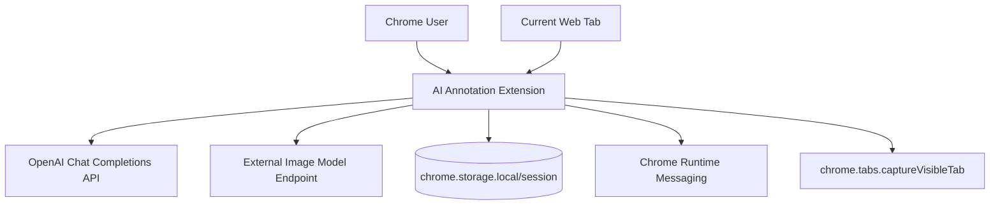
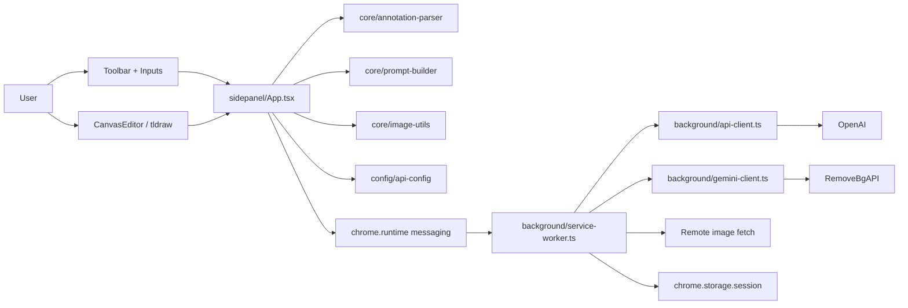
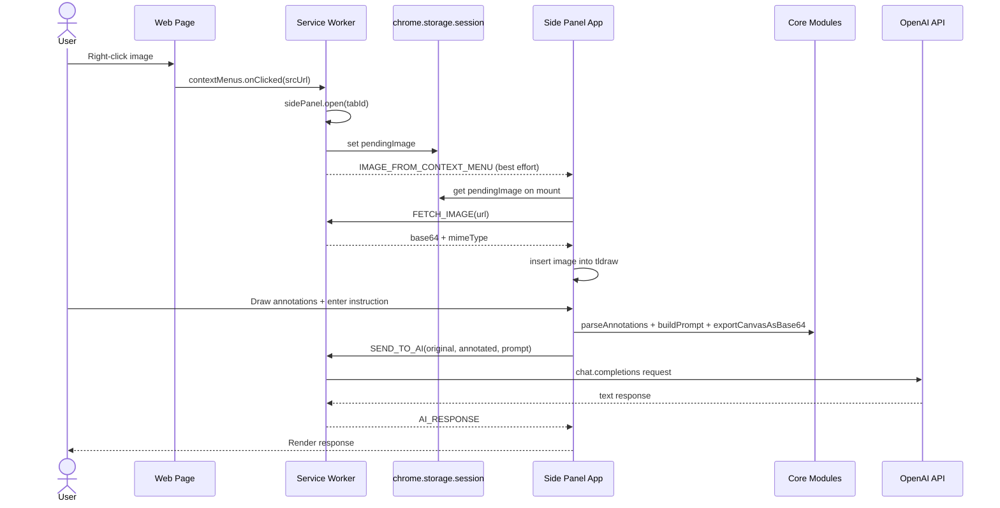
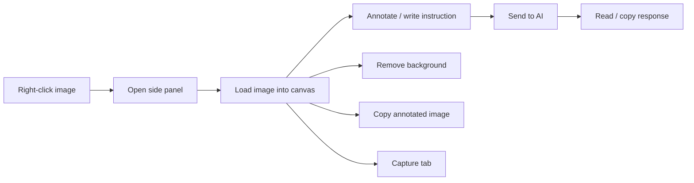
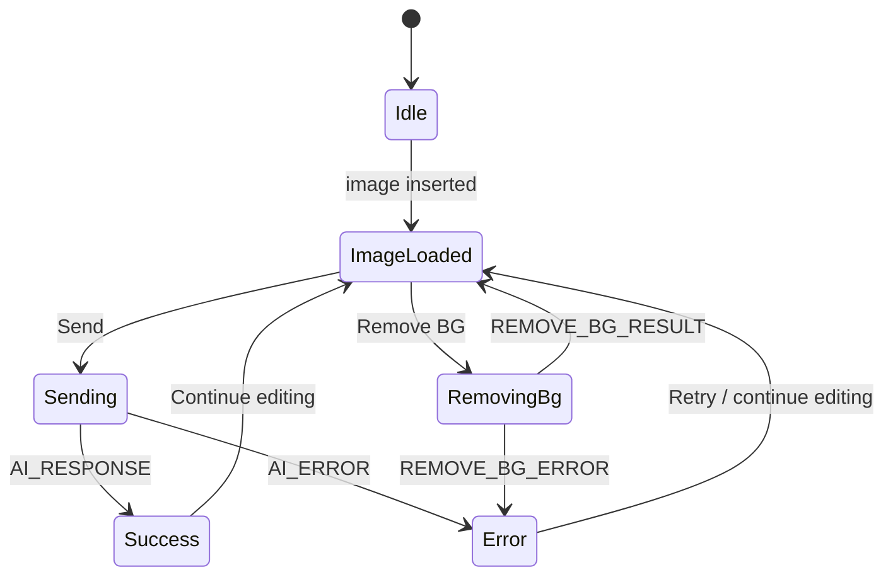

# Solution Design Document

## Validation Checklist

### CRITICAL GATES (Must Pass)

- [x] All required sections are complete
- [x] No [NEEDS CLARIFICATION] markers remain
- [x] Architecture pattern is clearly stated with rationale
- [ ] **All architecture decisions confirmed by user**
- [x] Every interface has specification

### QUALITY CHECKS (Should Pass)

- [x] All context sources are listed with relevance ratings
- [x] Project commands are discovered from actual project files
- [x] Constraints -> Strategy -> Design -> Implementation path is logical
- [x] Every component in diagram has directory mapping
- [x] Error handling covers all error types
- [x] Quality requirements are specific and measurable
- [x] Component names consistent across diagrams
- [x] A developer could implement from this design

---

## Constraints

CON-1 The product is a Chrome Manifest V3 extension and must operate within MV3 service worker lifecycle, side panel, and permission constraints.
CON-2 Core UX depends on a narrow side panel, so image review, annotation, and result display must remain usable at roughly 320-500px width.
CON-3 Cross-origin image loading must happen through privileged extension context because image sources may block normal page-context fetches.
CON-4 Current repository has no backend service; all orchestration runs in-browser via React UI, Chrome APIs, and third-party HTTP APIs.
CON-5 AI analysis currently depends on user-provided API key in `chrome.storage.local`, while background removal depends on a separate hard-coded external endpoint, creating security and maintainability constraints.
CON-6 The current project has no automated tests or lint scripts, so design must define measurable quality expectations even though enforcement is not yet implemented.

## Implementation Context

**IMPORTANT**: You MUST read and analyze ALL listed context sources to understand constraints, patterns, and existing architecture.

### Required Context Sources

#### Documentation Context
```yaml
- doc: README.md
  relevance: LOW
  why: "Repository landing page; confirms there is no meaningful end-user documentation yet."

- doc: CLAUDE.md
  relevance: HIGH
  why: "Contains the original implementation plan and intent behind extension workflows."

- doc: docs/specs/001-ai-annotation-extension/solution-design.md
  relevance: HIGH
  why: "Earlier architecture spec shows intended module boundaries and highlights where the code has drifted."

- doc: /Users/jc/.agents/skills/architecture-design/template.md
  relevance: HIGH
  why: "Defines the required SDD structure used for this document."

- doc: /Users/jc/.agents/skills/architecture-design/validation.md
  relevance: HIGH
  why: "Defines the completeness and consistency checks for this SDD."
```

#### Code Context
```yaml
- file: extension/package.json
  relevance: CRITICAL
  why: "Source of truth for build tooling, runtime dependencies, and available commands."

- file: extension/manifest.json
  relevance: CRITICAL
  why: "Defines Chrome extension runtime surface, permissions, host access, background worker, and side panel entry."

- file: extension/src/background/service-worker.ts
  relevance: CRITICAL
  why: "Implements event routing, side panel opening, session handshake, screenshot capture, and AI dispatch."

- file: extension/src/background/api-client.ts
  relevance: CRITICAL
  why: "Implements the main outbound AI analysis integration against OpenAI chat completions."

- file: extension/src/background/gemini-client.ts
  relevance: HIGH
  why: "Implements the remove-background workflow through a separate external image model endpoint."

- file: extension/src/sidepanel/App.tsx
  relevance: CRITICAL
  why: "Main composition root for UI state, message handling, annotation export, and user commands."

- file: extension/src/sidepanel/components/CanvasEditor.tsx
  relevance: HIGH
  why: "Defines the tldraw canvas host used by the editor surface."

- file: extension/src/sidepanel/components/Toolbar.tsx
  relevance: MEDIUM
  why: "Documents available user actions and UI state dependencies."

- file: extension/src/sidepanel/components/ResultPanel.tsx
  relevance: MEDIUM
  why: "Defines the output surface for AI responses and user copy workflow."

- file: extension/src/core/annotation-parser.ts
  relevance: CRITICAL
  why: "Encodes the annotation domain model and region-merging behavior."

- file: extension/src/core/coordinate-transform.ts
  relevance: HIGH
  why: "Defines normalization from canvas coordinates to image-relative coordinates."

- file: extension/src/core/prompt-builder.ts
  relevance: HIGH
  why: "Defines how parsed annotations become Vietnamese prompt instructions."

- file: extension/src/core/image-utils.ts
  relevance: CRITICAL
  why: "Owns image compression, insertion, export, clipboard, and local background-removal post-processing."

- file: extension/src/core/types.ts
  relevance: HIGH
  why: "Contains internal message and payload contracts shared across modules."

- file: extension/src/config/api-config.ts
  relevance: MEDIUM
  why: "Defines API key persistence strategy in extension storage."
```

#### External APIs (if applicable)
```yaml
- service: Chrome Extensions API (Manifest V3)
  doc: https://developer.chrome.com/docs/extensions/reference/
  relevance: CRITICAL
  why: "Defines sidePanel, runtime messaging, storage, contextMenus, tabs.captureVisibleTab, and service worker behavior."

- service: OpenAI Chat Completions API
  doc: https://platform.openai.com/docs/api-reference/chat/create
  relevance: CRITICAL
  why: "Defines the request and response contract used for image analysis."

- service: Browser Clipboard API
  doc: https://developer.mozilla.org/en-US/docs/Web/API/Clipboard
  relevance: MEDIUM
  why: "Used for copying annotated image output and result text."

- service: tldraw
  doc: https://tldraw.dev/
  relevance: HIGH
  why: "Defines editor lifecycle, shape model, asset handling, and image export APIs."
```

### Implementation Boundaries

- **Must Preserve**: Right-click image entry point, side panel editing flow, screenshot capture flow, manual annotation workflow, and AI response display.
- **Can Modify**: Internal message contracts, provider abstraction, shape parsing rules, permission scope, and UI composition details.
- **Must Not Touch**: Browser-global settings, non-extension systems, and unrelated repo artifacts outside the extension unless needed for documentation.

### External Interfaces

#### System Context Diagram



#### Interface Specifications

```yaml
inbound:
  - name: "Context Menu Image Action"
    type: Chrome extension event
    format: contextMenus.onClicked payload
    authentication: Chrome permission model
    doc: extension/src/background/service-worker.ts
    data_flow: "Receives srcUrl, pageUrl, and tab metadata when user right-clicks an image."

  - name: "Extension Action Click"
    type: Chrome extension event
    format: action.onClicked payload
    authentication: Chrome permission model
    doc: extension/src/background/service-worker.ts
    data_flow: "Opens the side panel without preloading an image."

  - name: "Clipboard Image Paste"
    type: DOM event
    format: ClipboardEvent
    authentication: User interaction within the side panel
    doc: extension/src/sidepanel/App.tsx
    data_flow: "Reads image/* clipboard items and inserts compressed image into canvas."

  - name: "Side Panel User Commands"
    type: React component callbacks
    format: local function calls plus runtime messages
    authentication: Extension UI session
    doc: extension/src/sidepanel/App.tsx
    data_flow: "Capture, send-to-AI, delete selection, clear canvas, save API key, remove background."

outbound:
  - name: "OpenAI Image Analysis Request"
    type: HTTPS
    format: JSON chat completion request with multimodal content
    authentication: Bearer API key from chrome.storage.local
    doc: extension/src/background/api-client.ts
    data_flow: "Sends original image, annotated image, and prompt to model gpt-4o."
    criticality: HIGH

  - name: "Background Removal Request"
    type: HTTPS
    format: JSON chat completion request with image_url content
    authentication: Hard-coded bearer token in source
    doc: extension/src/background/gemini-client.ts
    data_flow: "Sends original or cropped image and optional prompt to external endpoint returning image output."
    criticality: HIGH

  - name: "Cross-Origin Image Fetch"
    type: HTTPS
    format: binary image response converted to base64
    authentication: Manifest host permissions
    doc: extension/src/background/service-worker.ts
    data_flow: "Fetches user-selected source image from remote origin so it can be inserted into canvas."
    criticality: HIGH

data:
  - name: "Local API Key Storage"
    type: chrome.storage.local
    connection: Extension storage API
    doc: extension/src/config/api-config.ts
    data_flow: "Stores user-supplied OpenAI key."

  - name: "Pending Image Handshake"
    type: chrome.storage.session
    connection: Extension storage API
    doc: extension/src/background/service-worker.ts
    data_flow: "Bridges race between context-menu click and side panel mount using a short-lived pendingImage record."

  - name: "Canvas State"
    type: in-memory tldraw editor store
    connection: React runtime
    doc: extension/src/sidepanel/App.tsx
    data_flow: "Stores image asset, annotation shapes, selections, and exportable composed canvas."
```

### Cross-Component Boundaries (if applicable)

- **API Contracts**: Runtime message types (`CAPTURE_TAB`, `IMAGE_CAPTURED`, `FETCH_IMAGE`, `SEND_TO_AI`, `REMOVE_BG`) and payloads in `extension/src/core/types.ts`.
- **Team Ownership**: Single-team codebase, but ownership boundaries should remain `background` for Chrome/runtime orchestration, `sidepanel` for UI, `core` for pure domain logic, `config` for persistence helpers.
- **Shared Resources**: `chrome.storage.local`, `chrome.storage.session`, `chrome.runtime` message bus, and `tldraw` shape schema.
- **Breaking Change Policy**: Changes to runtime message shapes or `ParsedAnnotation` structure require simultaneous update in both sender and receiver modules because there is no compatibility layer yet.

### Project Commands

```bash
# Core Commands (discovered from project files)
Install: cd extension && pnpm install
Dev:     cd extension && pnpm dev
Test:    Not available in extension/package.json
Lint:    Not available in extension/package.json
Build:   cd extension && pnpm build

# Database (if applicable)
Migrate: Not applicable
Seed:    Not applicable
```

## Solution Strategy

- Architecture Pattern: Modular client-only extension with layered separation between Chrome runtime orchestration (`background`), UI composition (`sidepanel`), shared domain logic (`core`), and configuration persistence (`config`).
- Integration Approach: Use Chrome runtime messaging as the transport between the side panel and the service worker, keeping network and permission-sensitive operations in the background context.
- Justification: This matches MV3 restrictions, isolates testable pure logic in `core`, and prevents the React UI from directly owning privileged extension/network operations.
- Key Decisions: Normalize annotations relative to the base image, export the whole annotated canvas for visual context, store a pending image in `chrome.storage.session` to handle side panel mount timing, and keep API key storage local to the extension.

## Building Block View

### Components



### Directory Map

**Component**: extension-shell
```text
.
├── extension/
│   ├── manifest.json                         # MODIFY: Permission model, background worker, side panel entry
│   ├── package.json                          # MODIFY: Build scripts and dependencies
│   ├── vite.config.ts                        # MODIFY: Vite extension build configuration
│   └── tsconfig.json                         # MODIFY: TypeScript compiler settings
```

**Component**: background-runtime
```text
.
├── extension/src/background/
│   ├── service-worker.ts                     # MODIFY: Context menu, side panel open, runtime message router
│   ├── api-client.ts                         # MODIFY: OpenAI multimodal analysis client
│   ├── gemini-client.ts                      # MODIFY: External background-removal client
│   └── image-fetcher.ts                      # EXISTS but currently unused by service-worker; candidate for consolidation
```

**Component**: sidepanel-ui
```text
.
├── extension/src/sidepanel/
│   ├── index.html                            # MODIFY: Side panel HTML shell
│   ├── main.tsx                              # MODIFY: React bootstrap
│   ├── App.tsx                               # MODIFY: Main state coordinator and runtime interaction point
│   ├── styles.css                            # MODIFY: Side panel layout and visual states
│   └── components/
│       ├── CanvasEditor.tsx                  # MODIFY: tldraw mount surface
│       ├── Toolbar.tsx                       # MODIFY: Top actions
│       └── ResultPanel.tsx                   # MODIFY: Response and copy feedback
```

**Component**: domain-core
```text
.
├── extension/src/core/
│   ├── types.ts                              # MODIFY: Shared contracts
│   ├── coordinate-transform.ts               # MODIFY: Canvas to image-relative coordinate conversion
│   ├── annotation-parser.ts                  # MODIFY: Shape parsing and note/highlight merge logic
│   ├── prompt-builder.ts                     # MODIFY: Human-readable Vietnamese prompt generation
│   └── image-utils.ts                        # MODIFY: Compression, export, clipboard, crop, chroma-key cleanup
```

**Component**: config-and-bridge
```text
.
├── extension/src/config/
│   └── api-config.ts                         # MODIFY: Local API key persistence
├── extension/src/content/
│   └── capture.ts                            # LOW USAGE: Trigger-only content script bridge for capture
```

### Interface Specifications

#### Interface Documentation References

```yaml
interfaces:
  - name: "Runtime Message Contract"
    doc: extension/src/core/types.ts
    relevance: CRITICAL
    sections: [MessageType, APIRequest, RemoveBgRequest, RemoveBgResult]
    why: "This is the main internal interface between UI and background runtime."

  - name: "Side Panel Orchestration"
    doc: extension/src/sidepanel/App.tsx
    relevance: CRITICAL
    sections: [loadImageFromUrl, handleSend, handleRemoveBg, pendingImage handshake]
    why: "Documents the application-level control flow and message consumption."

  - name: "AI Analysis Client"
    doc: extension/src/background/api-client.ts
    relevance: HIGH
    sections: [getStoredApiKey, sendToAI]
    why: "Defines the outbound contract to the analysis provider."

  - name: "Background Removal Client"
    doc: extension/src/background/gemini-client.ts
    relevance: HIGH
    sections: [removeBackground, GeminiImageResult]
    why: "Defines the outbound contract to the secondary image endpoint."
```

#### Data Storage Changes

```yaml
Storage: chrome.storage.local
  Keys:
    - apiKey: string
  Purpose: "Persist user OpenAI API key between sessions."

Storage: chrome.storage.session
  Keys:
    - pendingImage.srcUrl: string
    - pendingImage.pageUrl: string | undefined
    - pendingImage.pageTitle: string | undefined
    - pendingImage.timestamp: number
  Purpose: "Short-lived handshake when the side panel has not mounted yet."

Schema Changes:
  - No relational or server-side database changes.
  - No migrations required.
```

#### Internal API Changes

```yaml
Endpoint: FETCH_IMAGE
  Method: chrome.runtime.sendMessage
  Path: internal message bus
  Request:
    type: "FETCH_IMAGE"
    payload.url: string
  Response:
    success:
      base64: string
      mimeType: string
    error:
      error: string

Endpoint: SEND_TO_AI
  Method: chrome.runtime.sendMessage
  Path: internal message bus
  Request:
    type: "SEND_TO_AI"
    payload.originalImage: base64 string
    payload.annotatedImage: base64 string
    payload.prompt: string
  Response:
    success:
      type: "AI_RESPONSE"
      payload.text: string
    error:
      type: "AI_ERROR"
      payload.error: string

Endpoint: REMOVE_BG
  Method: chrome.runtime.sendMessage
  Path: internal message bus
  Request:
    type: "REMOVE_BG"
    payload.imageBase64: base64 string
    payload.mimeType: string
    payload.prompt: string | undefined
  Response:
    success:
      type: "REMOVE_BG_RESULT"
      payload.imageBase64: string
      payload.mimeType: string
      payload.text: string | undefined
    error:
      type: "REMOVE_BG_ERROR"
      payload.error: string
```

#### Application Data Models

```pseudocode
ENTITY: ImageMeta (EXISTING)
  FIELDS:
    sourceUrl: string
    objectUrl: string
    base64: string | undefined

  BEHAVIORS:
    Tracks the current working source image for send/export/remove-bg flows.

ENTITY: ParsedAnnotation (EXISTING)
  FIELDS:
    type: "highlight" | "arrow" | "instruction" | "freehand-circle"
    region: NormalizedRect | undefined
    pointer: { from, to } | undefined
    text: string | undefined
    _shapeId: string
    _merged: boolean | undefined

  BEHAVIORS:
    Represents a normalized semantic interpretation of user-drawn tldraw shapes.

ENTITY: APIRequest (EXISTING)
  FIELDS:
    originalImage: string
    annotatedImage: string
    prompt: string

  BEHAVIORS:
    Encapsulates the payload sent to the primary AI analysis provider.

ENTITY: RemoveBgResult (EXISTING)
  FIELDS:
    imageBase64: string
    mimeType: string
    text: string | undefined

  BEHAVIORS:
    Represents the generated cutout result before local alpha cleanup.
```

#### Integration Points

```yaml
- from: sidepanel/App.tsx
  to: background/service-worker.ts
  protocol: chrome.runtime messaging
  doc: extension/src/core/types.ts
  endpoints: [FETCH_IMAGE, CAPTURE_TAB, SEND_TO_AI, REMOVE_BG]
  data_flow: "UI requests privileged fetches, tab screenshots, and outbound AI calls."

- from: background/service-worker.ts
  to: chrome.storage.session
  protocol: Chrome extension storage API
  doc: extension/src/background/service-worker.ts
  endpoints: [pendingImage set/get/remove]
  data_flow: "Worker stores a temporary image handoff for side panel startup."

OpenAI_Chat_Completions:
  - doc: extension/src/background/api-client.ts
  - sections: [messages payload, authorization header, response parsing]
  - integration: "Primary analysis provider receives original image, annotated image, and generated prompt."
  - critical_data: [originalImage, annotatedImage, prompt, apiKey]

External_Remove_BG_Endpoint:
  - doc: extension/src/background/gemini-client.ts
  - sections: [request body, image extraction from response]
  - integration: "Secondary provider generates an image with flat background for local alpha-key cleanup."
  - critical_data: [imageBase64, mimeType, prompt]
```

### Implementation Examples

**Purpose**: Provide strategic code examples to clarify complex logic, critical algorithms, or integration patterns. These examples are for guidance, not prescriptive implementation.

**Include examples for**:
- Complex business logic that needs clarification
- Critical algorithms or calculations
- Non-obvious integration patterns
- Security-sensitive implementations
- Performance-critical sections

#### Example: Side Panel Startup Handshake

**Why this example**: The main non-obvious runtime issue in MV3 is that the side panel may not be mounted when the user clicks the context menu. The current design uses a dual-path handshake to prevent image loss.

```typescript
// background/service-worker.ts
chrome.contextMenus.onClicked.addListener(async (info, tab) => {
  if (info.menuItemId !== 'annotate-image' || !info.srcUrl) return

  await chrome.sidePanel.open({ tabId: tab!.id! })

  await chrome.storage.session.set({
    pendingImage: {
      srcUrl: info.srcUrl,
      pageUrl: info.pageUrl,
      pageTitle: tab?.title,
      timestamp: Date.now(),
    },
  })

  try {
    await chrome.runtime.sendMessage({
      type: 'IMAGE_FROM_CONTEXT_MENU',
      payload: { srcUrl: info.srcUrl },
    })
  } catch {
    // Side panel not mounted yet; App.tsx reads pendingImage on startup.
  }
})
```

#### Example: Coordinate Normalization for Annotation Semantics

**Why this example**: AI prompt quality depends on mapping tldraw canvas coordinates back to the underlying image independent of zoom, viewport size, or panel width.

```typescript
function normalizeToImageCoords(
  canvasRect: { x: number; y: number; w: number; h: number },
  imageShape: { x: number; y: number; props: { w: number; h: number } }
) {
  const imgX = imageShape.x
  const imgY = imageShape.y
  const imgW = imageShape.props.w
  const imgH = imageShape.props.h

  return {
    x: Math.max(0, Math.min(1, (canvasRect.x - imgX) / imgW)),
    y: Math.max(0, Math.min(1, (canvasRect.y - imgY) / imgH)),
    w: Math.max(0, Math.min(1, canvasRect.w / imgW)),
    h: Math.max(0, Math.min(1, canvasRect.h / imgH)),
  }
}
```

#### Test Examples as Interface Documentation

```javascript
describe('parseAnnotations', () => {
  it('merges nearby text instructions into highlight annotations', () => {
    const annotations = [
      { type: 'highlight', region: { x: 0.2, y: 0.2, w: 0.2, h: 0.2 }, _shapeId: 'a' },
      { type: 'instruction', text: 'làm sáng hơn', region: { x: 0.22, y: 0.22, w: 0.1, h: 0.05 }, _shapeId: 'b' },
    ]

    const result = resolveProximityRelations(annotations)

    expect(result).toEqual([
      {
        type: 'highlight',
        region: { x: 0.2, y: 0.2, w: 0.2, h: 0.2 },
        text: 'làm sáng hơn',
        _shapeId: 'a',
      },
    ])
  })
})
```

## Runtime View

### Primary Flow

#### Primary Flow: Right-click Image, Annotate, Send to AI
1. User right-clicks an image in the browser and selects the extension context-menu item.
2. Service worker opens the side panel synchronously, stores `pendingImage` in `chrome.storage.session`, and attempts a direct runtime message.
3. Side panel mounts and either receives `IMAGE_FROM_CONTEXT_MENU` immediately or loads the pending image from session storage.
4. Side panel requests `FETCH_IMAGE` from the service worker to retrieve the remote image and convert it to base64.
5. `App.tsx` inserts the image into the tldraw canvas and records `imageMeta` and `imageShapeId`.
6. User draws highlights, arrows, and text instructions over the image.
7. On send, `annotation-parser.ts` converts shapes into normalized semantic annotations and `prompt-builder.ts` converts them into Vietnamese prompt text.
8. `image-utils.ts` exports the full annotated canvas as PNG base64 and resolves the original image base64.
9. Side panel sends `SEND_TO_AI` to the service worker.
10. `api-client.ts` sends a multimodal request to OpenAI and returns the generated text.
11. Side panel renders the response in `ResultPanel`.



### Error Handling

- Invalid input: Disable send when no image or API key is present; ignore invalid context-menu clicks without `srcUrl`.
- Network failure: Background fetch and AI requests return `{ error }` or `AI_ERROR`; UI displays error text in `ResultPanel`.
- Business rule violation: If API key is missing, `api-client.ts` throws explicit configuration error; UI prompts user to save a key first.
- Startup race: `pendingImage` in session storage acts as recovery when direct messaging fails because panel is not mounted.
- Provider response mismatch: If remove-background endpoint returns no image, `gemini-client.ts` throws a descriptive error using returned text when available.

### Complex Logic (if applicable)

```text
ALGORITHM: Build semantic AI prompt from canvas state
INPUT: tldraw editor state, selected base image shape, optional user instruction
OUTPUT: prompt string for multimodal model

1. VALIDATE: imageShape exists, current page shapes are available
2. TRANSFORM: convert non-image shapes into ParsedAnnotation entries
3. APPLY_BUSINESS_RULES:
   - Normalize coordinates relative to the image bounds
   - Merge nearby text notes into highlights if region distance < 0.05
   - Count arrows and summarize free text instructions
4. INTEGRATE: combine semantic summary with explicit user instruction
5. PERSIST: no persistent storage; hold derived prompt in transient UI state only
6. RESPOND: return Vietnamese prompt text to the caller
```

## Deployment View

### Single Application Deployment
- **Environment**: Client-side Chrome extension built with Vite and loaded as an unpacked or packaged MV3 extension.
- **Configuration**: User must provide an OpenAI API key stored in `chrome.storage.local`; manifest permissions and host permissions must match remote domains; remove-background endpoint currently also requires a hard-coded bearer token embedded in code.
- **Dependencies**: Chrome browser with side panel support, remote access to OpenAI API, remote access to `api.antamediadhcp.com`, and remote image origins allowed by manifest host permissions.
- **Performance**: Initial interaction target is panel-open-to-image-visible under 2 seconds on normal broadband for a 2 MB image; send-to-response target under 12 seconds excluding third-party latency spikes; image export/copy should complete under 2 seconds for typical images up to 1920x1080.

### Multi-Component Coordination (if applicable)

- **Deployment Order**: Update `manifest.json` and background worker together with any runtime message contract changes; deploy UI and core changes in the same extension package.
- **Version Dependencies**: `service-worker.ts`, `App.tsx`, and `types.ts` must remain in lockstep because messages are not versioned.
- **Feature Flags**: None currently; new provider abstraction or permission tightening should be gated by simple config constants before release.
- **Rollback Strategy**: Revert to previous extension build package; no migrations are required.
- **Data Migration Sequencing**: Not applicable beyond preserving the `apiKey` key name in `chrome.storage.local`.

## Cross-Cutting Concepts

### Pattern Documentation

```yaml
- pattern: extension/src/background/service-worker.ts
  relevance: CRITICAL
  why: "Documents the event-driven orchestration pattern used by the extension runtime."

- pattern: extension/src/core/annotation-parser.ts
  relevance: HIGH
  why: "Documents the normalization-and-merge pattern used to translate drawing primitives into semantic instructions."

- pattern: extension/src/sidepanel/App.tsx
  relevance: HIGH
  why: "Documents the single composition-root pattern for UI state and command handling."

- pattern: plan.md (NEW)
  relevance: MEDIUM
  why: "Captures the intended architecture boundaries and quality constraints missing from user-facing docs."
```

### User Interface & UX (if applicable)

**Information Architecture:**
- Navigation: Single-surface side panel with top toolbar, central canvas, bottom instruction bar, and conditional result panel.
- Content Organization: Input actions live in the toolbar, drawing occurs in the canvas, AI instruction is entered at the bottom, and response appears only when relevant.
- User Flows: Primary flow is right-click image -> annotate -> send; secondary flows are paste image, capture tab, copy result, and remove background.

**Design System:**
- Components: Custom lightweight React components around `tldraw`; no shared external design system.
- Tokens: Styling is defined in `styles.css`; current implementation uses direct class-based styling rather than formal tokens.
- Patterns: Inline feedback states for loading, copy success/error, disabled send state, and conditional settings/API key bar.

**Interaction Design:**
- State Management: Local React state in `App.tsx` plus tldraw internal store for editor session state.
- Feedback: Loading indicators on send and remove-bg actions, inline API-key prompt, conditional response/error panel, copy-state icon changes.
- Accessibility: Basic keyboard support exists for `Ctrl/Cmd+Enter`; broader accessibility support, focus order verification, and screen reader semantics remain to be improved.

#### UI Visualization Guide

**Entry Points** — Use ASCII wireframes to show where features live:
```text
┌─────────────────────────────────────────┐
│ Capture  Delete  Remove BG  Copy   Key │
├─────────────────────────────────────────┤
│                                         │
│          tldraw canvas editor           │
│       image + annotation workspace      │
│                                         │
├─────────────────────────────────────────┤
│ [ Describe what to change...      ] Send│
├─────────────────────────────────────────┤
│ AI Response / Error / Loading           │
└─────────────────────────────────────────┘
```

**Screen Flows** — Use Mermaid flowcharts for navigation:


**Component States** — Use Mermaid state diagrams for interactions:


### System-Wide Patterns

- Security: Store only the user API key in `chrome.storage.local`; network calls requiring secret credentials should stay in background context; current hard-coded bearer token and broad host permissions are known exceptions that should be removed.
- Error Handling: Background modules convert transport/provider failures to message responses; UI keeps failures local and non-fatal so users can keep editing.
- Performance: Compress pasted images before insertion, export only on demand, and use image-relative coordinates rather than repeated expensive geometry conversions.
- i18n/L10n: Prompting and expected model output are Vietnamese-first; UI strings are currently hard-coded English and Vietnamese mixed, so localization is not yet standardized.
- Logging/Auditing: Current implementation relies on `console.error`; there is no structured telemetry or audit trail.

### Multi-Component Patterns (if applicable)

- **Communication Patterns**: Synchronous UI callbacks inside the side panel combined with asynchronous request-response over `chrome.runtime` between UI and background.
- **Data Consistency**: Session storage is used as temporary eventual consistency for startup handoff; otherwise state is local to a single extension instance.
- **Shared Code**: Shared types and pure functions live in `extension/src/core`.
- **Service Discovery**: Not applicable beyond statically configured remote URLs and manifest host permissions.
- **Circuit Breakers**: None currently; provider failures surface directly to UI.
- **Distributed Tracing**: None currently; message correlation IDs are not implemented.

## Architecture Decisions

- [ ] ADR-1 Extension runtime pattern: Keep a client-only MV3 architecture with privileged operations in `background/service-worker.ts` and editor logic in `sidepanel/App.tsx`.
  - Rationale: Aligns with Chrome permissions model and keeps the React UI free of direct privileged API dependencies.
  - Trade-offs: Adds runtime message contracts and startup synchronization complexity.
  - User confirmed: _Pending_

- [ ] ADR-2 Annotation model: Normalize annotations to image-relative coordinates and send both structured prompt text and full annotated canvas to the AI provider.
  - Rationale: Improves precision across varying viewport sizes while preserving visual context for the model.
  - Trade-offs: Requires extra export work and some duplicated information in the AI request.
  - User confirmed: _Pending_

- [ ] ADR-3 Persistence strategy: Store only lightweight local state (`apiKey`, `pendingImage`) in Chrome storage and keep canvas/session data in memory.
  - Rationale: Minimizes persistence complexity and fits the single-session editing workflow.
  - Trade-offs: No history, no recovery after extension/browser restart, and no multi-image sessions.
  - User confirmed: _Pending_

- [ ] ADR-4 Provider split: Keep analysis and remove-background as separate outbound integrations until a unified provider abstraction is introduced.
  - Rationale: Matches current working code and avoids blocking the existing background-removal workflow.
  - Trade-offs: Two provider contracts, inconsistent secret handling, and duplicated request plumbing.
  - User confirmed: _Pending_

## Quality Requirements

- Performance: Side panel shall display a selected image within 2 seconds for a typical 2 MB remote image on normal broadband; send-to-AI request preparation shall complete within 2 seconds for a 1920x1080 source image.
- Usability: Primary actions shall remain accessible within a 360px side panel width; send action shall be available by button and `Ctrl/Cmd+Enter`; errors shall appear inline without clearing user annotations.
- Security: No user-provided API key shall be written outside `chrome.storage.local`; future revisions shall remove hard-coded credentials from source and restrict host permissions to required domains only.
- Reliability: If direct context-menu messaging fails because the panel is not mounted, the image handoff shall still succeed through `chrome.storage.session` within a 10-second validity window.

## Acceptance Criteria

Translate each critical PRD acceptance scenario into a system-level specification using EARS format. These criteria define the technical "done" for implementation.

Use the appropriate EARS pattern for each criterion:
- **UBIQUITOUS**: `THE SYSTEM SHALL [action]` - always-on behavior
- **EVENT-DRIVEN**: `WHEN [trigger], THE SYSTEM SHALL [action]` - user/system events
- **STATE-DRIVEN**: `WHILE [state], THE SYSTEM SHALL [action]` - mode-dependent
- **OPTIONAL**: `WHERE [feature enabled], THE SYSTEM SHALL [action]` - configurable
- **COMPLEX**: `IF [condition], THEN THE SYSTEM SHALL [action]` - business rules

**Main Flow Criteria: Image Annotation Workflow**
- [ ] WHEN the user clicks the `annotate-image` context-menu item on an image, THE SYSTEM SHALL open the side panel for the current tab and enqueue the selected image for loading.
- [ ] WHEN the side panel becomes available with a pending image, THE SYSTEM SHALL fetch the remote image through the background runtime and insert it into the canvas.
- [ ] WHEN the user sends the request, THE SYSTEM SHALL export the annotated canvas, build a semantic prompt, and call the AI analysis provider.
- [ ] THE SYSTEM SHALL render the returned AI text inside the result panel without clearing the existing canvas.

**Error Handling Criteria: Runtime and Provider Failures**
- [ ] WHEN remote image fetch fails, THE SYSTEM SHALL keep the side panel usable and surface a non-crashing error path.
- [ ] IF the OpenAI API key is missing, THEN THE SYSTEM SHALL prevent successful analysis calls and prompt the user to save a key.
- [ ] WHEN the remove-background provider returns an error or no image, THE SYSTEM SHALL show the error in the UI and preserve the current editor state.

**Edge Case Criteria: Startup Race and Narrow Layout**
- [ ] WHILE the side panel is still mounting after a context-menu click, THE SYSTEM SHALL preserve the selected image reference in `chrome.storage.session`.
- [ ] IF no image is loaded, THEN THE SYSTEM SHALL disable the send action.
- [ ] WHILE the panel width is constrained, THE SYSTEM SHALL keep capture, remove-bg, copy, settings, and send actions reachable without a separate page.

## Risks and Technical Debt

### Known Technical Issues

- `extension/src/background/gemini-client.ts` contains a hard-coded bearer token, which is a direct credential exposure risk.
- `extension/manifest.json` grants `<all_urls>` and multiple broad host permissions, which is wider than the minimum scope required for the current documented workflows.
- `extension/src/core/types.ts` defines `ContextMenuPayload` and `PendingImage` with `base64`, but `service-worker.ts` currently sends/stores only `srcUrl` metadata; the contract is inconsistent.
- `extension/src/background/image-fetcher.ts` exists but is not used by `service-worker.ts`, creating duplicate fetch logic and drift risk.

### Technical Debt

- No automated tests cover annotation parsing, prompt generation, or runtime message contracts.
- Provider integrations are hard-coded rather than abstracted, making future changes expensive and increasing coupling.
- UI strings and model prompt language strategy are mixed and not centralized.
- Error telemetry is limited to console output, so production diagnosis will be weak.

### Implementation Gotchas

- `chrome.sidePanel.open` must be called in the original user gesture path before long async work or Chrome may reject the call.
- `tldraw` image insertion uses data URLs instead of `blob:` URLs because the current editor path rejects blob protocol assets.
- Shape IDs and image shape tracking can become stale if the base image is deleted; `App.tsx` partially handles this only for selected deletion.
- `tabs.captureVisibleTab` behavior depends on active window permissions and may fail differently across browsing contexts.

## Glossary

### Domain Terms

| Term | Definition | Context |
|------|------------|---------|
| Annotation | Any user-drawn mark or note over the image to indicate desired changes | Core user action inside the side panel |
| Highlight | A geometric region drawn over the image to call attention to an area | Parsed from `geo` shapes in `annotation-parser.ts` |
| Instruction | Free-text note associated with either a nearby highlight or the overall image | Built from `text` shapes and bottom instruction input |
| Remove BG | Workflow that requests background removal from an external image model | Triggered by the toolbar button |

### Technical Terms

| Term | Definition | Context |
|------|------------|---------|
| MV3 | Manifest Version 3 for Chrome extensions | Governs service worker, permissions, and runtime model |
| Side Panel | Chrome extension surface docked alongside the active tab | Main application shell for this product |
| Normalized Coordinates | Position and size values mapped into a 0..1 range relative to the source image | Used to make annotation semantics resolution-independent |
| tldraw | Canvas editor library used for drawing and exporting shapes | Powers the image annotation workspace |

### API/Interface Terms

| Term | Definition | Context |
|------|------------|---------|
| `chrome.runtime.sendMessage` | Chrome API for request-response messaging between extension contexts | Main internal transport between UI and background |
| Chat Completions | OpenAI endpoint that accepts multimodal message arrays and returns generated text | Used by `api-client.ts` |
| `chrome.storage.session` | Session-scoped extension storage cleared with the browser session | Used for `pendingImage` startup recovery |
| Data URL | Base64-encoded `data:` URI containing image bytes | Used for image insertion and outbound model payloads |
